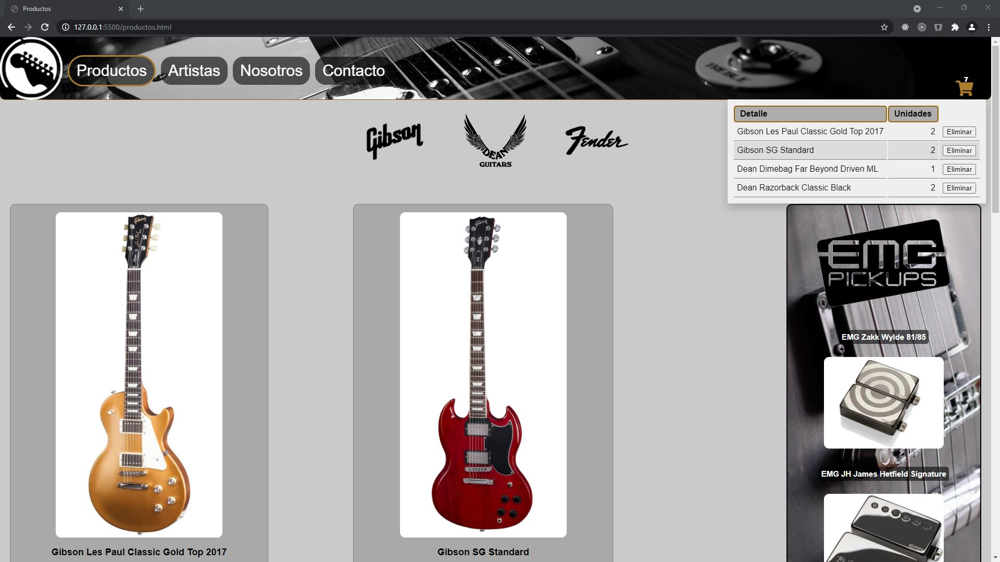
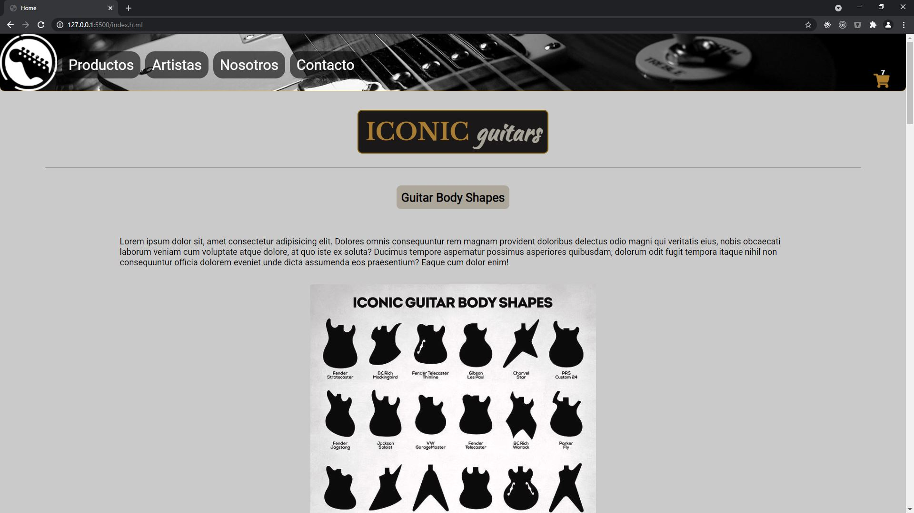

# joaquin-guitars
Web de venta de guitarras con carro de compras básico, construida con HTML5, CSS3, Javascript y Vue.js.

Consigna: crear funcionalidades tanto con Vanilla Javascript como con Vue.js.

El proyecto incluye:

* Responsive Web Design
* Maquetación con Flexbox y Grid
* Dropdown creado con Vanilla Javascript
* Agregar y eliminar productos del Dropdown con Vue.js
* Uso de localStorage
## Demo 🔗

[ONLINE VERSION](https://joaquin-guitars-3.netlify.app/index.html)

## Tecnologías utilizadas 🛠️

- HTML5
- CSS3
- Javascript
- Vue.js

## Instalación 🔧

1. Clonar repositorio
    ```bash
    git clone
    ```
2. Abrir index.html con cualquier navegador
## Preview 📷



